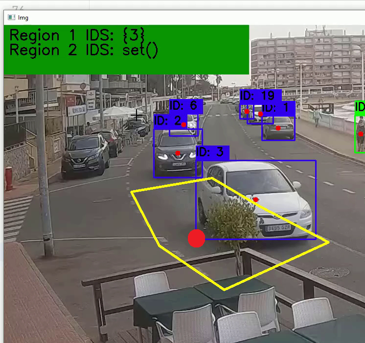

# Counting Cars
 <br>
---
*This project is based on counting car numbers from a live CCTV, still it's currently in development process.*

### `Project code:`
```python
import cv2
import numpy as np

def count_cars(video_path):
    net = cv2.dnn.readNet(r"D:\1. APPS\Works\Akash1\Projects\Vehicle_counting.py\yolov3.cfg", r"D:\1. APPS\Works\Akash1\Projects\Vehicle_counting.py\yolov3.weights")
    layer_names = net.getUnconnectedOutLayersNames()

    cap = cv2.VideoCapture(video_path)

    car_count = 0
    frame_skip = 5  # Process every 5th frame
    frame_count = 0

    while True:
        ret, frame = cap.read()
        if not ret:
            break

        frame_count += 1
        if frame_count % frame_skip != 0:
            continue

        height, width, _ = frame.shape
        blob = cv2.dnn.blobFromImage(frame, 0.00392, (416, 416), (0, 0, 0), True, crop=False)
        net.setInput(blob)
        outs = net.forward(layer_names)

        for out in outs:
            for detection in out:
                scores = detection[5:]
                class_id = np.argmax(scores)
                confidence = scores[class_id]

                if class_id == 2 and confidence > 0.2:
                    car_count += 1

        cv2.putText(frame, f'Car Count: {car_count}', (10, 30), cv2.FONT_HERSHEY_SIMPLEX, 1, (0, 255, 0), 2)
        cv2.imshow('Car Counting', frame)

        key = cv2.waitKey(30)  # Delay of 30 milliseconds

        # Add this condition to break the loop when the user closes the window
        if key == 27 or key == ord('q'):
            break

    cv2.waitKey(0)  # Wait indefinitely for a key press
    cap.release()
    cv2.destroyAllWindows()

if __name__ == "__main__":
    video_path = r"D:\1. APPS\Works\Akash1\Projects\Vehicle_counting.py\video.mp4"
    count_cars(video_path)
``` 

### ```Here I used:```
```
1. OpenCV Library:
I used the OpenCV library for computer vision tasks.

2. NumPy Library:
NumPy was used for numerical operations on arrays.

3. YOLO (You Only Look Once) Model:
The code utilizes the YOLO (You Only Look Once) model for object detection.

4. YOLO Configuration and Weights:
You specified the configuration file (yolov3.cfg) and the pre-trained weights file (yolov3.weights) for the YOLO model.

5. Video Input:
The script takes a video file as input for vehicle counting.

6. Frame Skipping:
To speed up processing, you skip some frames using the frame_skip variable.

7. Bounding Box and Confidence Thresholding:
The code extracts bounding boxes around detected objects and applies a confidence threshold for car detection.

8. Car Counting:
A counter (car_count) keeps track of the number of cars detected.

9. User Interaction:
The script allows the user to exit the video window by pressing the 'q' key or the 'Esc' key.

10. Video File Path:
I provided a sample video file path in the script.

```


##### My Linkedin profile: &nbsp; [Akash's-Linkedin-Account][Linkedin_Account]  

<!--Linkedin profile link here:-->
[Linkedin_Account]: https://www.linkedin.com/in/akash-sarkar59/
